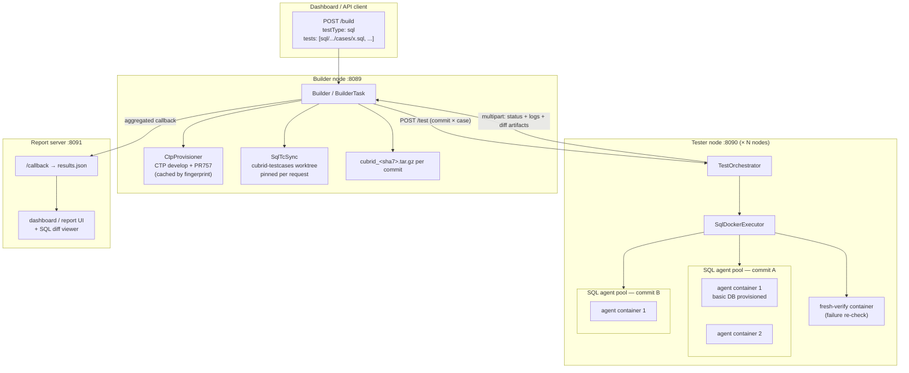
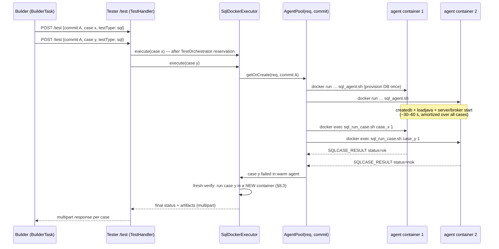

# SQL Tester Runner — Design

**Status:** Implemented (see [SQL_TESTER.md](SQL_TESTER.md) for usage; §12 milestones 1–5 delivered)
**Scope:** Add a Docker-based SQL test-case runner to Builder-Tester, with full integration into the existing request pipeline and the report-server UI. The Builder is unchanged in what it produces (per-commit CUBRID build tarballs); the Tester gains a new SQL execution path.

---

## 1. Goals and non-goals

### Goals
- Accept SQL test cases from `https://github.com/CUBRID/cubrid-testcases` in the canonical format `sql/<...>/cases/<tc_name>.sql` (expected output at sibling `answers/<tc_name>.answer`).
- Execute each case inside Docker against every requested commit's build, using **latest CTP `develop` with PR [#757](https://github.com/CUBRID/cubrid-testtools/pull/757) applied on top** (`bin/run_sql.sh` — single-case execution via `ConsoleAgent`).
- Reuse the existing orchestration untouched wherever it is test-type-agnostic: request queue, smart scheduling, retry/flaky detection (`run_mode`/`min_runs`/`max_runs`), multipart result transport, callback schema, verdict analysis.
- Multi-agent parallel execution: a pool of warm "SQL agent" containers per commit on each tester node, pulling cases from a work queue, with fresh-container verification of failures.
- Report-server UI: SQL-aware report rendering — per-case expected/actual **answer diff viewer**, case source view, test-type badges on dashboard and reports.

### Non-goals (extension paths noted where relevant)
- `medium/`, `isolation/`, `sql_by_cci`, HA-replication suites (§13).
- Answer-file *generation* (interactive answer-making stays a manual CTP workflow).
- Windows testers (PR #757's script is Linux-only; so is our Docker path).

---

## 2. Background facts the design rests on

### 2.1 Current shell pipeline (what we plug into)
- **Builder** (`Builder.java`, port 8089): one active request at a time (`MAX_CONCURRENT_REQUESTS=1`, `Builder.java:32`), builds commits sequentially in the `cubridci/cubridci:develop` container, packages `cubrid_<sha7>.tar.gz`, then distributes `(commit × test)` units to tester nodes over HTTP `POST /test` — either smart scheduling (`BuilderTask.distributeTestsWithSmartScheduling`) or a legacy work queue.
- **Tester** (`Tester.java`, port 8090): `TestOrchestrator` handles admission (reservations, headroom, circuit breaker) and retry/flaky logic; execution strategies live in `exec/` (`DirectExecutor`, `StandardDockerExecutor`, `OptimizedDockerExecutor`). The optimized path bakes a **per-commit image** `cubrid-test:<commit>_<baseline>` (CUBRID pre-installed at `/opt/cubrid`) via `DockerImageBuilder` (`docker commit`, LRU-evicted), stages host CTP into `/workspace/CTP`, and runs a generated `run_test.sh`.
- **Test-type coupling today**: paths must start with `shell/`, `shell_heavy/`, `shell_perf/` and end `.sh` (`ALLOWED_SHELL_TEST_ROOTS`, `Builder.java:35`; `validateRequest`, `Builder.java:788-814`). `TestRequest.java` has no type field. Result parsing greps `<base>.result` for `OK|NOK` (`OptimizedDockerExecutor.java:525-566`).
- **Report server** (`report-server/`, Node/Express, port 8091): file-based, everything under `log/requests/req_*/` (`results.json`, `request.json`, `tests/*.log`, `report.html`). Verdicts (`Regression introduced`, `Pre-existing failure`, `Flaky`, …) computed in `reportService.analyzeVerdict` from the per-test × per-commit status matrix — already test-type-agnostic.

### 2.2 SQL test-case format (`cubrid-testcases`)
- Case = `sql/<...>/cases/<tc>.sql`; expected output = `sql/<...>/answers/<tc>.answer` (same basename). **Depth between `sql/` and `cases/` varies 1–6 levels** — discovery/validation must key on the `/cases/` path component, never on depth.
- 35 suites (`_01_object` … `_36_guava`), ~17.4k cases. Auxiliary conventions CTP handles internally: `--+ holdcas`, `--+ server-message`, `--@queryplan` directives; `<tc>.queryPlan` marker files; answer variants (`.answer_D_<charset>_C_<collation>`, `.answer_win`, `.answer_cci`); exclude lists under `sql/config/`.
- A case without an answer file is *not executed* by CTP (`shouldRun=false`, counted "not run").

### 2.3 CTP SQL execution
- Full-suite entry: `ctp.sh sql -c conf` → `CTP/sql/bin/run.sh` does everything: conf overrides via `bin/ini.sh` (`test_mode=yes`, `java_stored_procedure=yes`, broker port 33120, …), `cubrid createdb <db> <charset>`, compiles + `loadjava`s stored-procedure classes, starts server + broker, rewrites the live broker port into `CTP/sql/configuration/Function_Db/<db>_qa.xml`, then runs `ConsoleAgent runCQT` over the scenario tree, and finally tears the environment down.
- **Pass/fail** = string equality of produced output vs `.answer` after stripping all `\r`/`\n`. Failed cases get `<case>.result` (actual output) + copies of `.sql`/`.answer` in the result root; `main.info` carries totals; core files are detected and flagged.
- Env prerequisites: `$CUBRID`, `$JAVA_HOME`, `TZ='Asia/Seoul'` (cases depend on it), `LC_ALL=en_US`.

### 2.4 PR #757 (`run_sql.sh`) — the single-case primitive
- New standalone `CTP/bin/run_sql.sh <sql_file> [db_name]` (default db `basic`): invokes `ConsoleAgent runCQT sql sql 64 test_default.xml "<file>?db=<db>_qa"` directly. **Assumes CUBRID server + broker already running** and the DB already created — it does none of run.sh's provisioning.
- Output: `Result Root Dir:<dir>` line + per-case `Testing <path> (1/1 100.00%) [OK|NOK]`. Machine-readable results in the result root (`main.info`, per-case `.result` on failure).
- **Caveats we design around**: (a) exit code is 0 even on `[NOK]` — must parse output/`main.info`; (b) the broker port inside `Function_Db/<db>_qa.xml` must match the actually-running broker; (c) answer file must exist or the case silently becomes "not run"; (d) PR state: open against `develop`, `mergeable_state: clean`, three commits, zero Java changes — trivially cherry-pickable.

---

## 3. High-level architecture



Everything above the Tester's executor layer is the existing machinery. The new components are shaded into three seams:

1. **Builder seam** — request validation/typing, `SqlTcSync`, `CtpProvisioner` (§5, §6).
2. **Tester seam** — `SqlDockerExecutor` + generated container scripts + `SqlResultParser` + agent pool (§7, §8).
3. **Report seam** — `testType` + per-attempt artifacts in the results schema, diff viewer UI (§10).

---

## 4. Request schema and validation

### 4.1 Request changes
`POST /build` gains an optional field, defaulting to today's behavior:

```json
{
  "commits": ["<sha>", "..."],
  "tests": ["sql/_01_object/_01_type/_004_integer/cases/1014.sql"],
  "testType": "sql",
  "buildType": "debug",
  "runMode": "fixed-runs",
  "callbackUrl": "http://reporthost:8091/callback"
}
```

- `testType ∈ {shell, sql}`, default `shell`. Mixed-type requests are **rejected** in v1 (one type per request keeps scheduling profiles, repo sync, and the report legend simple; §13 discusses lifting this).
- If `testType` is omitted but every test path starts with `sql/`, infer `sql` (log the inference).

### 4.2 Validation (`Builder.validateRequest`, `Builder.java:722`)
For `testType=sql`, replace the shell rules with:
- path starts with `sql/` (new `ALLOWED_SQL_TEST_ROOTS = {"sql/"}`; `medium/` reserved for later);
- path contains a `/cases/` component and ends with `.sql` (depth between `sql/` and `cases/` is variable — do **not** validate depth);
- path resolves inside the synced testcase repo (post-sync existence check in `BuilderTask`, same as shell's `TestDirectoryResolver` pass);
- warn-level (non-fatal) check: sibling `answers/<name>.answer` missing → the case will report `execution_error: no answer file` rather than silently "not run" (§9.2).

### 4.3 Plumbing
- `TestRequest.java`: add `testType` (serialized through `BuilderTask.runTest`'s `/test` payload, `BuilderTask.java:1829`).
- `Tester`'s `TestHandler` routes on `testType`: `shell` → existing executors, `sql` → `SqlDockerExecutor`.
- `request.json` snapshot and callback payload carry `testType` for the report server.

---

## 5. SQL testcase repo management — `SqlTcSync`

Mirror of the shell flow, against the public repo:

- New config: `sql_tc_dir=~/cubrid-testcases`, `sql_tc_branch=develop`, `sql_tc_preferred_remote=upstream` (fallback `origin`), `sql_tc_sync_mode=per_request|per_test|disabled`.
- Refactor `git/ShellTcSync.java` into a parameterized `TcRepoSync` (repo dir, branch, remote taken from config), with `ShellTcSync`/`SqlTcSync` as thin instantiations. Behavior is identical: fetch + fast-forward, resolve the exact commit at request admission (`resolveShellTcReference` → generalized `resolveTcReference`), create an isolated **git worktree per requestId** so every tester attempt sees the same pinned tree.
- The worktree is mounted into containers exactly as shell does: `-v <repoWorktree>:/workspace/testcases:rw` (`EnvScriptFactory.TESTCASE_MOUNT`). SQL cases are read-only in practice, but keep `rw` + the existing overlayfs trick so CTP's habit of writing next to cases (e.g. interactive `.result` files) can never dirty the worktree.

---

## 6. CTP provisioning — latest develop + PR #757

The host clone of `cubrid-testtools` is on a working branch (`builder_tester_refactor_tester`), so the SQL runner must **not** stage CTP from the host checkout the way the shell path does. New builder-side component:

### `CtpProvisioner`
- Config: `ctp_sql_repo=https://github.com/CUBRID/cubrid-testtools.git`, `ctp_sql_ref=develop`, `ctp_sql_prs=757` (comma-separated PR numbers layered in order), optional `ctp_sql_pin=<sha>` to freeze the base for reproducibility.
- Algorithm (at request setup, once per request):
  1. Maintain a bare cache clone under `<work_dir>/ctp_sql/repo.git`; `git fetch origin develop` and `git fetch origin pull/757/head`.
  2. Fingerprint = `sha7(developHead) + "_" + sha7(pr757Head)`. If `<work_dir>/ctp_sql/payload_<fingerprint>/` exists → reuse.
  3. Else: worktree develop, `git merge --no-edit <pr757Head>` (PR is `mergeable_state: clean`; on conflict → fail the request with a clear `setup` phase error telling the operator to pin), then copy `CTP/{bin,common,conf,sql}` into the payload dir. No compilation is needed — `CTP/sql/lib/*.jar` and `CTP/common/lib/cubridqa-common.jar` are prebuilt in-repo.
  4. Record `{ctpDevelopSha, pr757Sha, fingerprint}` into `request.json` (surfaces in the report header, §10.3).
- The payload is staged into the per-request workspace as `<workDir>/CTP` and mounted at `/workspace/CTP` — the same staging seam `OptimizedDockerExecutor.stageCtpResources` uses today, minus the host-checkout source. Shell requests keep their current staging untouched.
- LRU-evict old `payload_*` dirs (reuse the `build_cache_size` pattern).

**Why merge at the builder, not bake into the image:** CTP is mounted, not baked, so per-commit Docker images (`cubrid-test:<commit>_<baseline>`) stay valid when CTP develop moves or PR 757 evolves — no image-cache invalidation.

---

## 7. Docker execution design

### 7.1 Image strategy — reuse per-commit images unchanged
`DockerImageBuilder` already produces exactly what SQL needs: `cubrid-test:<commit>_<baseline>` with the built CUBRID extracted to `/opt/cubrid` and env preset, derived from `cubridci/cubridci:test_shell` (which ships the JDK CTP requires — the shell path already runs CTP from it). SQL adds **zero** image-build work; both test types share the image cache for the same commit.

Fallback tier mirrors shell: if `optimized_docker_enabled=false` or image build fails, a `StandardSqlDockerExecutor` variant extracts `build.tar.gz` at container start (same pattern as `StandardDockerExecutor`).

### 7.2 Container anatomy (one SQL agent)

```
docker run -d --init
  --name tester_sql_<buildType>_<commit>_<reqShort>_<agentN>
  --log-driver json-file --log-opt max-size=50m --log-opt max-file=3
  [--cpus/--memory per existing docker-limit keys]
  --tmpfs /tmp:exec,size=2G --shm-size=2g
  -v <dockerWorkDir>:/workspace
  -v <sqlRepoWorktree>:/workspace/testcases:rw
  -e CTP_HOME=/workspace/CTP -e TZ=Asia/Seoul -e LC_ALL=en_US
  -e HOST_UID -e HOST_GID
  -w /workspace --entrypoint bash cubrid-test:<commit>_<baseline>
  -lc /workspace/sql_agent.sh
```

Notes:
- **No `--cap-add SYS_ADMIN` needed** (that exists for shell's overlayfs remount trick; SQL writes only under `/workspace` and `$CUBRID/databases`). Keep the overlay only if we reuse the shared script path.
- **Port/IPC isolation is free**: each container gets its own network + IPC namespace, so every agent can use the stock broker port (33000) and stock shm keys with no cross-agent conflict — no port arithmetic, and `Function_Db/basic_qa.xml`'s default `localhost:33000` URL is correct as-is provided we configure the broker to 33000 (§7.3). This is the key simplification Docker buys us over CTP's bare-metal port-juggling.
- Containers run detached (`-d`) because agents are long-lived within a request (§8); teardown is explicit.

### 7.3 Generated scripts (`EnvScriptFactory.createSqlAgentScript`)

Two generated artifacts per agent, following the existing "scripts are emitted at runtime, not files on disk" convention:

**`sql_env_setup.sh` — provision once per container** (replicates the relevant `CTP/sql/bin/run.sh` steps, using CTP's own `bin/ini.sh` for conf edits):
1. Env: `CUBRID=/opt/cubrid`, `CUBRID_DATABASES=$CUBRID/databases`, extend `PATH`/`LD_LIBRARY_PATH`, verify `java -version` works, `export CTP_HOME TZ LC_ALL`.
2. `cubrid.conf` overrides (the shipped `[sql/cubrid.conf]` defaults): `java_stored_procedure=yes`, `test_mode=yes`, `max_plan_cache_entries=1000`, `unicode_input_normalization=no`, `lock_timeout=10sec`, `ha_mode=no` (single-node SQL run; HA answer parity is a non-goal). Broker conf: `%query_editor SERVICE=OFF`, `%BROKER1 BROKER_PORT=33000 APPL_SERVER_SHM_ID=33000`.
3. `cubrid createdb ${sql_createdb_opts:---db-volume-size=512M} basic ${sql_db_charset:-en_US.iso88591}`.
4. Stored procedures: `javac` + `loadjava` everything under `$CTP_HOME/sql/function/stored_procedure/src` (needed by `_08_javasp` and others; skip-able via `sql_load_stored_procedures=false` for speed when the request touches none — default **on** for correctness).
5. Start: `cubrid server start basic`, `cubrid broker start`; wait-loop until the broker answers on 33000.
6. Sanity-write the dburl into `$CTP_HOME/sql/configuration/Function_Db/basic_qa.xml` (same `sed` run.sh performs) — defensive vs. a stale port in the payload; also refresh `sql/configuration/local.properties` `dbversion`/`dbbuildnumber` from `cubrid_rel` so the result-dir name is truthful (PR 757 never updates it).
7. Exit non-zero on any step failure → the agent reports `environment_error` for its assigned cases and the pool replaces it (§8.3).

**`sql_run_case.sh <case-rel-path> <attempt>` — one case execution** (invoked via `docker exec` by the pool, §8.2):
1. `OUT=/workspace/results/<caseKey>/attempt_<n>`; `mkdir -p`.
2. `timeout ${sql_case_timeout_sec:-300} $CTP_HOME/bin/run_sql.sh /workspace/testcases/<case-rel-path> basic > $OUT/console.log 2>&1`; capture the `timeout` exit status separately (124 → `execution_error: timeout`).
3. Parse `console.log`: extract `Result Root Dir:` and the `[OK]/[NOK]` verdict (**never trust the exit code** — PR 757's script exits 0 on NOK).
4. On `[NOK]`: copy from the result root the actual output `<case>.result` → `$OUT/actual.result`; copy `answers/<case>.answer` → `$OUT/expected.answer`; `diff -u expected.answer actual.result > $OUT/answer.diff` (normalized copy with `\r`/`\n`-stripping mirroring CTP's comparison, so the diff shows only real differences).
5. Core check: scan `$CUBRID` for `core*` (same as run.sh); if found, `analyzer.sh`-style callstack → `$OUT/core.err`, flag in the status line, and mark the agent **tainted** (§8.3).
6. Emit one machine-readable line to stdout for the executor: `SQLCASE_RESULT status=<ok|nok|notrun|timeout|error> core=<0|1> dir=<OUT>`. `notrun` is detected when the console output shows the case counted but not executed (missing answer file).

### 7.4 Result flow back to the Builder
`SqlResultParser` (tester-side, Java) maps the per-attempt artifacts into the existing multipart response (`HttpResponseWriter.sendMultipart`): JSON `response` field (status, attempts, flaky, message) + file parts. New attachment set per attempt alongside today's `log_attempt_N`:

| part name | content |
|---|---|
| `log_attempt_N` | `console.log` (run_sql.sh stdout — keeps existing log viewer working with zero changes) |
| `answer_diff_attempt_N` | unified diff (only on fail) |
| `actual_result_attempt_N` | actual output (only on fail) |
| `expected_answer_attempt_N` | expected answer (only on fail) |
| `case_source` | the `.sql` file itself (once, not per attempt) |
| `core_err_attempt_N` | callstack (only when a core was produced) |

The Builder persists these under `log/requests/<req>/tests/` (existing path the report server already serves via `/api/logs/:req/tests/:file`) and lists them in `attemptLogMetadata[]` with a new `artifactType` discriminator.

---

## 8. Multi-agent parallel execution flow

Three layers of parallelism, from coarse to fine:

### 8.1 Layer 1 — Builder → tester nodes (existing, reused)
The Builder distributes `(commit × case)` units exactly as it distributes shell tests — smart scheduling (`distributeTestsWithSmartScheduling`) or legacy work queue — across all configured tester nodes. One addition: `TestClassifier`/`test_profiles.json` gets a default **SQL profile** (`durationClass=SHORT`, low IO weight; typical SQL cases run in seconds), so the scheduler packs SQL units densely instead of treating unknown tests as heavyweight. Per-node concurrency still respects `/health`-reported slot counts.

### 8.2 Layer 2 — per-commit SQL agent pool on each tester node (new)



Mechanics:
- **Pool keying & sizing**: `AgentPool` keyed `(requestId, commit)`. Size grows on demand up to `sql_agents_per_commit` (default: derived — `min(max_concurrent_tests, outstanding cases for that commit)`), each agent consuming one `TestOrchestrator` concurrency slot for its lifetime so SQL and shell workloads share the same admission accounting. Idle agents past `sql_agent_idle_timeout_sec` (default 120) are reaped.
- **Dispatch**: each incoming `/test` enqueues onto the pool's case queue; free agents pull next case (work-stealing — no static sharding, so one slow case never blocks a partition).
- **Why warm agents**: DB provisioning (createdb + SP loadjava + server/broker start) costs ~30–60 s; a case costs seconds. Per-case containers would be >90 % overhead at any realistic case count. The pool amortizes provisioning to once per agent.
- **Configurable degenerate mode**: `sql_exec_mode=per_case` forces one-container-per-case (provision → run → destroy). This is the v1 milestone (simplest correct implementation) and remains the maximal-isolation option; `pool` becomes the default in v2 (§12).

### 8.3 Layer 3 — hygiene and failure verification (new)
Warm agents trade isolation for speed; these rules buy the isolation back where it matters:

- **Fresh-verify on failure** (`sql_fresh_verify_on_fail=true`, default on): a case that fails (`nok`, or any error) in a warm agent is re-executed once in a **brand-new container with a fresh DB** before being reported. Fresh run passes → report the warm failure as attempt noise (feeds the existing flaky machinery); fresh run fails → report `fail` with the fresh run's artifacts (guaranteed uncontaminated diff). This eliminates cross-case contamination false-positives (cases can leak tables/params; CTP's per-case reset only restores session/system params, not schema).
- **Retry/flaky integration**: `run_mode=fixed-runs/min_runs/max_runs` reuse `TestOrchestrator.runTestWithRetry` unchanged; attempts ≥2 always run in fresh containers so flaky classification isn't polluted by agent state.
- **Tainted agents**: an agent whose case produced a core file, whose server/broker health probe fails, or that hit `sql_agent_max_cases` (default 500, DB bloat guard) is drained and replaced with a fresh container; in-flight case is retried on another agent (once).
- **Cancellation**: `/cancel-request` propagation (existing) additionally tears down the request's pools; container names carry the `tester_sql_<...>` prefix so the existing startup/периodic container-cleanup sweeps catch orphans.

### 8.4 Worked example
Request: 3 commits × 40 SQL cases, 2 tester nodes, `sql_agents_per_commit=4`.
- Builder builds 3 tarballs sequentially (unchanged), then floods `3×40=120` `/test` units across both nodes.
- Each node lazily spins up to 4 agents per commit it receives work for (≤12 containers/node), each provisioning `basic` once (~45 s, overlapped across agents), then chews through its queue at seconds/case.
- 2 failing cases each get one fresh-verify container; 1 is confirmed (report shows `fail` + answer diff), 1 passes fresh (flagged toward `flaky` by the retry loop).
- Pools reaped on request completion; callback aggregates as today.

---

## 9. Status mapping and result semantics

### 9.1 Status mapping (`tester/TestStatus.java` — no new enum values needed)

| CTP/agent outcome | reported status | message / artifacts |
|---|---|---|
| `[OK]` | `pass` | — |
| `[NOK]` confirmed by fresh-verify | `fail` | answer diff + actual/expected + case source |
| `[NOK]` warm, `[OK]` fresh (and vice-versa across attempts) | `flaky` (existing rules) | per-attempt artifacts |
| missing answer file (`notrun`) | `execution_error` | `"no answer file: .../answers/<tc>.answer"` |
| `timeout` (per-case `timeout` hit) | `execution_error` | console log; agent replaced |
| provisioning failure, docker failure | `environment_error` | setup log |
| core file produced | `fail` | + `core.err` callstack; agent tainted |
| build tarball unavailable | `build_error` (existing) | — |

**Design choice — missing answer is an error, not "not run":** in CTP batch semantics an answerless case silently counts as neither pass nor fail. In a CI regression tool, a user who explicitly listed a case must be told loudly why it produced no verdict.

### 9.2 Callback / `results.json` schema additions (backward-compatible)
Each `results[]` entry gains: `testType: "sql"`, and `attemptLogMetadata[]` entries gain `artifactType ∈ {console, answer_diff, actual_result, expected_answer, case_source, core_err}` plus `executionEnv ∈ {warm_agent, fresh_container}`. Top level gains `ctpProvenance: {developSha, pr757Sha}`. Absent fields keep today's meaning, so old shell reports render unchanged.

---

## 10. Report-server integration

### 10.1 Backend (`report-server/src/`)
- `services/reportService.js`: pass `testType` through; verdict logic (`analyzeVerdict`) is status-matrix-based and needs **no change**. `calculateTestStatistics` gains a per-type breakdown when a request is SQL.
- `services/fileService.js`: recognize the new artifact filenames under `tests/` (already served by the generic log endpoints — `/api/logs/:req/tests/:file` needs no route change; add MIME/`text/plain` hinting for `.diff`, `.answer`, `.result`, `.sql`).
- `routes/api.js`: no new endpoints required. Optional nicety: `GET /api/case-source/:req/:file` alias for syntax-highlighted case view (or reuse the log endpoint and highlight client-side).

### 10.2 Dashboard (`views/dashboard.ejs`, `public/js/dashboard.js`)
- **Test Type selector** on the Build Test Request card (`Shell` | `SQL`), driving:
  - client-side path validation hints (`sql/**/cases/*.sql` pattern, `/cases/` required, `.sql` suffix) mirroring §4.2;
  - the JSON payload's `testType`.
- Recent Reports list rows get a type badge (`SQL` / `SHELL`) sourced from `request.json`/`results.json`.

### 10.3 Report view (`public/js/report.js`, `report/report-template.html`)
The per-test × per-commit status matrix, verdicts, attempt logs, and JSON/CSV export all work as-is. SQL-specific additions:
- **Answer-diff panel** per failed (case, commit) cell: render `answer_diff_attempt_N` as a colorized unified diff (client-side, no new deps — simple `+`/`-` line classing), with tabs for *Diff* / *Actual* / *Expected* / *Case SQL* / *Console*, fed by the existing log endpoints using `artifactType` from `attemptLogMetadata`.
- Attempt chips distinguish `warm_agent` vs `fresh_container` runs (tooltip: contamination-check semantics from §8.3).
- Report header shows CTP provenance: `CTP develop @<sha7> + PR#757 @<sha7>` from `ctpProvenance` — essential for reproducing a result by hand (`run_sql.sh` at those SHAs).
- Core-file failures surface the `core.err` callstack in the existing log modal.

---

## 11. Configuration reference (new keys)

**`conf/builder.conf`**
```properties
# SQL testcase repo
sql_tc_dir=${HOME}/cubrid-testcases
sql_tc_branch=develop
sql_tc_preferred_remote=upstream
sql_tc_sync_mode=per_request        # per_request | per_test | disabled

# CTP payload for SQL execution
ctp_sql_repo=https://github.com/CUBRID/cubrid-testtools.git
ctp_sql_ref=develop
ctp_sql_prs=757                      # PRs layered on top, in order
#ctp_sql_pin=<sha>                   # optional: freeze base for reproducibility
```

**`conf/tester.conf`**
```properties
sql_exec_mode=pool                   # pool | per_case
sql_agents_per_commit=4              # cap; actual = min(cap, outstanding, free slots)
sql_agent_idle_timeout_sec=120
sql_agent_max_cases=500              # recycle agent after N cases
sql_case_timeout_sec=300
sql_fresh_verify_on_fail=true
sql_db_name=basic
sql_db_charset=en_US.iso88591
sql_createdb_opts=--db-volume-size=512M
sql_load_stored_procedures=true
```

Reused untouched: `run_mode`/`min_runs`/`max_runs`, all docker resource-limit keys, scheduling keys, `build_cache_size`, log-retention keys.

---

## 12. Implementation milestones

| # | Milestone | Touch points | Exit criterion |
|---|---|---|---|
| 1 | **Request typing & validation** | `TestRequest.java`, `Builder.java` (`ALLOWED_SQL_TEST_ROOTS`, `validateRequest`), `BuilderTask.runTest` payload, `TestHandler` routing | SQL request accepted, rejected paths get clear 400s; shell behavior bit-identical |
| 2 | **Repo & CTP provisioning** | `git/TcRepoSync` refactor + `SqlTcSync`; new `CtpProvisioner`; `request.json` provenance | payload dir contains merged CTP; fingerprint cache hit on second request |
| 3 | **v1 execution: `per_case` mode** | `exec/SqlDockerExecutor`, `EnvScriptFactory.createSqlAgentScript`/`createSqlCaseScript`, `SqlResultParser`, multipart artifact parts | single-case request returns pass/fail with diff artifacts end-to-end; `tests/fixtures/mock_testcases/sql/**` fixtures + bash tests green |
| 4 | **Report integration** | `reportService.js`, `report.js` diff panel, `dashboard.ejs`/`dashboard.js` type selector, badges, provenance header | failed SQL case shows colorized answer diff + case source in report UI |
| 5 | **v2 execution: agent pool** | `exec/sql/AgentPool`, taint/replace, fresh-verify, cancellation teardown, `TestClassifier` SQL profile | 3×40-case request: provisioning amortized (pool mode ≥5× faster than per_case), fresh-verify observable in report |
| 6 | **Hardening** | timeout/core/taint paths, orphan-container sweep coverage, docs (`docs/usage`), `bin/test_client_sql.sh` sample | failure-injection suite green (`tests/system/`) |

Milestone 3 ships a usable feature (correctness-first, isolation-maximal); 5 delivers the throughput.

---

## 13. Risks, open questions, extension paths

- **PR #757 drift / merge conflict**: mitigated by `ctp_sql_pin` and fail-fast in `CtpProvisioner` with an actionable error. If #757 merges into develop, `ctp_sql_prs` becomes a no-op (fetch of a merged PR head still resolves; provisioner should detect ancestor-of-develop and skip the merge).
- **JDK in `test_shell` image vs CTP jars**: the shell path already runs CTP's common jar in this image, and `cubridqa-cqt.jar` targets the same era of Java — verify once in milestone 3; if a newer JDK is ever required, bake it via `DockerImageBuilder.createSetupScript` (one-line change).
- **Answer variants** (`.answer_D_utf8_C_utf8_bin`, …): selected by CTP from `jdbc_config_file` run-modes. v1 pins `test_default.xml` + `en_US.iso88591` (matches upstream daily regression). A future `sql_jdbc_config_file`/`sql_db_charset` pairing unlocks charset suites — config-only change.
- **Cross-case DB contamination in pool mode**: bounded by fresh-verify (§8.3); residual risk is a *pass* that should have failed (masked by leftover state) — accepted for CI purposes, `per_case` mode exists for forensic runs, and `sql_agent_max_cases` bounds drift.
- **Stored-procedure load time** dominates provisioning for requests that never touch javasp — `sql_load_stored_procedures=false` is the escape hatch; auto-detection (case path under `_08_javasp`/plcsql suites) is a possible refinement.
- **Mixed shell+SQL requests**: schema supports it later (per-test `testType`); deferred to keep scheduling profiles and report legend simple.
- **`medium/` suite**: same cases/answers convention + `data_file` loaddb step in `sql_env_setup.sh` (mount `medium/files/mdb.tar.gz`, `cubrid loaddb`) — natural follow-on with `testType=medium`.
- **Exclude lists** (`sql/config/daily_regression_test_exclude_list_*.conf`): irrelevant while users submit explicit case lists; becomes relevant if we later add "run a whole suite directory" requests (validation would then accept `sql/.../` dir paths and expand server-side — the discovery rules in §2.2 already anticipate this).
