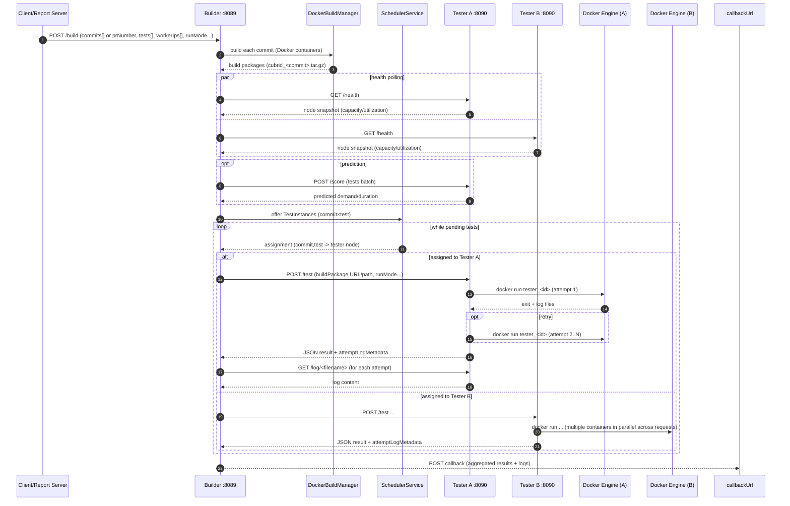

# Builder-Tester Docker Build & Test Architecture (Updated)

This document describes how **Builder** and one or more **Tester** nodes build CUBRID and execute shell test cases using Docker, and how the system schedules and collects results.

Important updates compared to older docs:
- The default test distribution is **Smart Scheduling** (multi-resource, cache-aware) rather than simple round-robin.
- Multiple tester nodes are first-class, and each tester runs **multiple Docker containers in parallel** (one per test attempt).
- The system supports additional request modes: **PR Number**, **Custom Script**, and **Build-Only** (artifact upload).

If you want the full scheduling theory, see `docs/SMART_SCHEDULING_ARCHITECTURE.md`. This document focuses on end-to-end architecture and Docker execution details.

---

## 0. Big Picture

### 0.1 Services and Responsibilities

- **Builder** (`:8089`)
  - Accepts `/build` requests (commits[] or prNumber)
  - Builds commit/PR artifacts (DockerBuildManager or direct fallback)
  - Distributes tests to one or more testers (Smart Scheduling by default)
  - Collects logs from testers (`/log/{filename}`) and sends callback
  - Optionally serves build packages to remote testers (`/download/build/*`)

- **Tester** (`:8090`) — one process per node
  - Accepts `/test` requests from builder
  - Runs tests using **Docker containers** (optimized/standard) or direct fallback
  - Exposes `/health` (capacity/utilization), `/score` (predictions), `/log/*` (log streaming)
  - Tracks stats in WAL and periodically exports `profiles/latest.json.gz` for scheduling

- **Report Server** (optional, `report-server`, default `:8091`)
  - Receives callback and renders dashboards/reports (user-facing)

### 0.2 High-Level Diagram (Builder ↔ Multiple Testers)

```mermaid
flowchart LR
  Client[Client / CI / QA] -->|POST /build| Builder[Builder :8089]
  ReportServer[Report Server :8091\n(optional)] -->|POST /api/builder/build| Builder
  Builder -->|GET /status| ReportServer

  subgraph BuildPhase[Build Phase]
    Builder --> DockerBuild[DockerBuildManager\n(build containers)]
    DockerBuild --> BuildPkgs[(Build packages\ncubrid_<commit>.tar.gz)]
  end

  subgraph Scheduling[Smart Scheduling (default)]
    Builder --> Scheduler[SchedulerService\nReadyQueue + ScoreFunction]
    Scheduler --> Assign[Assignments\n(commit,test)->node]
  end

  subgraph Testers[Multiple Tester Nodes]
    T1[Tester A :8090]:::tester
    T2[Tester B :8090]:::tester
    T3[Tester C :8090]:::tester
  end

  Builder -->|poll GET /health| T1
  Builder -->|poll GET /health| T2
  Builder -->|poll GET /health| T3
  Builder -->|optional POST /score| T1
  Builder -->|optional POST /score| T2
  Builder -->|optional POST /score| T3

  Builder -->|POST /test| T1
  Builder -->|POST /test| T2
  Builder -->|POST /test| T3

  T2 -->|GET /download/build/*\n(download build package)| Builder
  T3 -->|GET /download/build/*\n(download build package)| Builder

  Builder -->|GET /log/*\n(fetch test logs)| T1
  Builder -->|GET /log/*\n(fetch test logs)| T2
  Builder -->|GET /log/*\n(fetch test logs)| T3

  Builder -->|POST callbackUrl| Callback[Callback target\n(CI/Report Server)]

classDef tester fill:#E6EEF5,stroke:#D0D7DE,color:#111827;
```

---

## 1. Request Types (What Builder Accepts)

Builder accepts **one request** and can handle many commits/tests in a single run. This directly targets the “backtrack per commit” pain point: you request the full commit set once, and compare results in a single report.

### 1.1 Standard Multi-Commit Regression Request

```json
{
  "commits": ["<sha1>", "<sha2>", "<sha3>"],
  "tests": ["shell/.../cases/foo.sh", "shell/.../cases/bar.sh"],
  "workerIps": ["192.168.1.5:8090", "192.168.2.154:8090"],
  "callbackUrl": "http://<report-server>:8091/callback",
  "buildType": "debug",
  "runMode": "fixed-runs",
  "minRuns": 3,
  "maxRuns": 2
}
```

### 1.2 PR Number Mode (Merge-Before Verification)

```json
{
  "prNumber": 6402,
  "tests": ["shell/.../cases/foo.sh"],
  "workerIps": ["192.168.2.154:8090"],
  "callbackUrl": "http://<report-server>:8091/callback",
  "buildType": "debug"
}
```

The builder resolves:
- PR head SHA
- baseline SHA (merge-base with `develop` when possible; fallback to parent)

### 1.3 Custom Script Mode (Quick Patch Experiments)

This mode is designed for “no setup quick edits” (e.g., tweak wait, update answer/sql near the test).

```json
{
  "commits": ["develop"],
  "customShellScript": "#!/bin/bash\n...\n",
  "customScriptTestPath": "shell/.../cases/foo.sh",
  "customAttachments": [
    { "targetPath": "answers/foo.answer", "contentBase64": "..." }
  ],
  "workerIps": ["192.168.2.154:8090"],
  "callbackUrl": "http://<report-server>:8091/callback"
}
```

Notes:
- If `customShellScript` is present, the builder will synthesize a placeholder test name if needed.
- Attachments are written next to the executed custom script (optionally into the specified test directory).

### 1.4 Build-Only Mode (Artifacts Only)

Build-Only creates build packages but **skips tests**; it can also upload artifacts via SFTP.

```json
{
  "buildOnly": true,
  "commits": ["<sha1>", "<sha2>"],
  "buildType": "debug",
  "buildUpload": {
    "host": "<sftp-host>",
    "port": 22,
    "username": "...",
    "password": "...",
    "remoteDir": "/path/to/upload"
  }
}
```

---

## 2. Deployment Topology (Multiple Testers + Multiple Containers per Tester)

This is the core “relations” diagram: one Builder orchestrates many tester nodes; each tester node runs many Docker containers concurrently.

```mermaid
flowchart TB
  subgraph BuilderHost[Builder Host]
    BuilderProc[Builder JVM\n:8089]
    DockerDaemonB[(Docker Engine)]
    WorkB[(builder work_dir\nbuild_*/)]
    CC[(ccache dir)]
    Src[(cubrid_src_dir)]
    BuilderProc --> DockerDaemonB
    BuilderProc --> WorkB
    DockerDaemonB --> CC
    DockerDaemonB --> Src
  end

  subgraph TesterAHost[Tester Node A]
    TesterA[Tester JVM\n:8090]
    DockerDaemonA[(Docker Engine)]
    WorkA[(tester work_dir\nrequests/tests/)]
    ProfilesA[(profiles/\nWAL + latest.json.gz)]
    TesterA --> DockerDaemonA
    TesterA --> WorkA
    TesterA --> ProfilesA
    subgraph ContainersA[Docker containers (parallel)]
      A1[tester_<id>_1\ncontainer]
      A2[tester_<id>_2\ncontainer]
      A3[tester_<id>_3\ncontainer]
      A4[...]
    end
    DockerDaemonA --> ContainersA
  end

  subgraph TesterBHost[Tester Node B]
    TesterB[Tester JVM\n:8090]
    DockerDaemonB2[(Docker Engine)]
    subgraph ContainersB[Docker containers (parallel)]
      B1[tester_<id>_1]
      B2[tester_<id>_2]
      B3[...]
    end
    TesterB --> DockerDaemonB2
    DockerDaemonB2 --> ContainersB
  end

  BuilderProc -->|POST /test| TesterA
  BuilderProc -->|POST /test| TesterB

  BuilderProc -->|poll /health| TesterA
  BuilderProc -->|poll /health| TesterB

  BuilderProc -->|optional POST /score| TesterA
  BuilderProc -->|optional POST /score| TesterB
```

Key point: **Concurrency is at the tester**. If a tester advertises max concurrency 28, it can run ~28 test containers in parallel (subject to resource limits / circuit breakers).

---

## 3. Build Pipeline (DockerBuildManager)

### 3.1 Baseline & Commit Isolation (Build Modes)

Builder supports two build modes (see `commit_build_mode` in `builder.conf`):

- **`checkout` (default)**: No baseline selection or cherry-pick. Each commit is built by a direct `git checkout <commit>` using full history. Baseline-specific UI elements are hidden in reports/dashboards for this mode.
- **`baseline_cherrypick`**: Builder selects a baseline (typically the parent of the earliest commit) and builds each target commit in isolation so versions are consistent (baseline + 1).

For PR mode, Builder resolves PR head and baseline (merge-base with develop when possible).

### 3.2 Docker Build Container (Typical)

Builder runs builds in Docker (default) using:
- build image: `cubridci/cubridci:develop`
- shared mounts for build cache, gradle cache, and ccache
- a generated build script that handles git operations and packaging

### 3.3 Build Output: Build Package

Build output is a compressed package (e.g., `cubrid_<commit>.tar.gz`) containing the install layout, optimized for tester extraction.

Builder can:
- pass a local file path to local testers
- or publish via HTTP (`/download/build/*`) for remote testers

---

## 4. Test Pipeline (Tester: Multiple Containers)

Each `/test` request runs through `TestOrchestrator` and typically results in **one Docker container per attempt**:

### 4.1 Execution Strategies (Fallback Chain)

1. **Optimized Docker** (fast path): uses pre-built images/cache when enabled
2. **Standard Docker**: extracts the build package inside the container
3. **Direct** (fallback): executes on host when Docker is unavailable/disabled

### 4.2 Tester Concurrency Model (Containers per Tester)

Each tester node runs a single JVM process, but executes tests concurrently using a thread pool.
In Docker modes, each attempt runs in its own container (unless keep-alive/debug mode is used).

```mermaid
flowchart LR
  subgraph TesterNode[Tester Node (1 process) :8090]
    API[TestHandler\nPOST /test]
    Orch[TestOrchestrator\nreservation + retry]
    subgraph Pool[Executor pool\n(max_concurrent_tests*)]
      W1[Worker 1]
      W2[Worker 2]
      W3[Worker 3]
      WN[...]
    end
    API --> Orch --> Pool

    W1 -->|docker run| C1[(container: attempt)]
    W2 -->|docker run| C2[(container: attempt)]
    W3 -->|docker run| C3[(container: attempt)]
    WN -->|docker run| CN[(container: attempt)]

    Orch --> Logs[(Request logs\n+ attempt logs)]
    Orch --> Stats[(WAL observations\n+ latest.json.gz)]
  end
```

`*` Concurrency can be dynamically reduced/raised using “heavy queue” controls (e.g., `max_concurrent_tests_heavy_queue` → `max_concurrent_tests_post_heavy`) to avoid overload while heavy tests are running.

### 4.3 Run Modes for Unstable/Reproduction

`runMode` controls repeated execution:
- `fixed-runs`: run exactly N attempts (best for comparing commit matrices)
- `until-pass`: run until pass after minRuns (useful for recovery)
- `until-fail`: run until fail after minRuns (useful for reproduction)

Tester stores attempt logs separately (e.g., `docker_*.log`, `docker_*.2.log`, ...), and returns `attemptLogMetadata` so the UI can link to the right file.

---

## 5. Scheduling & Distribution (Smart Scheduling Default)

### 5.1 What Replaced Round-Robin

Older documentation described “global index round-robin.” That is now **legacy-only**.

Today, Builder chooses between:
- **Smart Scheduling** (default when `smart_scheduling_enabled=true`)
- **Legacy work-queue distribution** (when smart scheduling is disabled)

### 5.2 Inputs to Scheduling

Smart Scheduling uses:
- **Node health snapshots** from each tester (`GET /health`)
  - capacity / utilization / running tests / heavy-running hints
- **Predictions** (`POST /score`, optional)
  - predicted duration + resource demands for tests
- **Profiles/WAL** (`profiles/latest.json.gz`)
  - heavy/flaky hints derived from historical stats

### 5.3 High-Level Scheduling Loop

Conceptual flow (simplified):

```text
1) Poll testers → NodeDirectory snapshots
2) Load profiles/latest.json.gz → classify heavy/extreme
3) For each (commit × test), create TestInstance with predictions
4) Offer instances to SchedulerService (ReadyQueue separates mice/elephants)
5) assignNext() picks the best (test,node) pairing
6) Dispatch POST /test to chosen tester
7) Collect result + fetch logs via GET /log/<filename>
```

The goal is to reduce suite makespan and speed up root-cause detection by:
- avoiding overloading a single node
- respecting heterogeneous hardware
- using cache locality and predicted duration/demand

---

## 6. Detailed Sequence Diagram (One Build Request, Multiple Testers, Multiple Containers)



---

## 7. Logs, Reports, and Persistence (WAL)

### 7.1 Request-Scoped Logs

The system writes:
- system logs: `log/system/{builder.log,tester.log}`
- request logs: `log/requests/req_*/...`
  - build logs: `builds/build_<commitShort>.log`
  - test logs: `tests/docker_<commitShort>_<test>[.<attempt>].log`

Builder also retrieves remote tester logs via `/log/{filename}` when needed.

### 7.2 WAL / Profiles Export (Scheduling Data)

Tester persists per-test observations via WAL and periodically exports:
- `profiles/latest.json.gz`

Builder loads this file (from `tester_profiles_dir` in `builder.conf`) to:
- classify heavy/extreme tests
- compute elephant thresholds
- improve scheduling decisions

See `docs/wal/README.md` for details.

---

## 8. Configuration Pointers (Current Defaults)

These defaults evolve. The most important knobs for architecture behavior:

### Builder (`conf/builder.conf`)
- `listen_port=8089`
- `max_concurrent_builds=4`
- `smart_scheduling_enabled=true`
- `smart_scheduling_tester_nodes=...` (documented default cluster; request may override via workerIps)
- `tester_port=8090`
- `commit_build_mode=checkout` (`checkout` or `baseline_cherrypick`)
- `test_read_timeout_minutes=...`
- Run controls: `run_mode`, `min_runs`, `max_runs`, `time_budget_ms`
- Docker build/test images: `docker_build_image`, `docker_test_image`
- Docker limits: `docker_cpu_limit_millicores`, `docker_memory_limit_mb`, `docker_io_*`
- Profiles path: `tester_profiles_dir=~/tmp/tester_work/profiles`

### Tester (`conf/tester.conf`)
- `tester_port=8090`
- concurrency: `max_concurrent_tests`, `max_concurrent_tests_heavy_queue`, `max_concurrent_tests_post_heavy`
- metrics: `stats_enabled=true`, `wal_collection_enabled=true`, `score_endpoint_enabled=true`
- capacity modeling: `node_iops_capacity`, `node_io_mb_capacity`, overcommit/circuit breaker
- execution: `optimized_docker_enabled=true`, `docker_test_image=...`

---

## 9. Summary

Builder-Tester is designed to:
- build **multiple commits/PR heads** reproducibly
- execute tests across **multiple tester nodes**
- run tests with **multiple Docker containers per tester** (parallelism)
- reduce regression backtracking time through **commit×test matrix execution**
- speed up unstable analysis using **repeat/run modes + centralized logs/reports**

For deeper scheduling mechanics, see `docs/SMART_SCHEDULING_ARCHITECTURE.md`.
